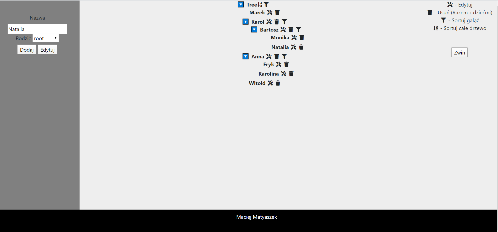

# Tree.API

Wykorzystane technologie: 
-.NET core 3.1 
-Sql Server 
-ASP.net 
-jQuerry 

W celu uruchomienia aplikacji należy podłączyć bazę danych do projektu. W związku z tym wybieramy "Łączenie z bazą danych"
w eksploratorze serwera. Następnie wybieramy w polu źródło danych Microsoft SQL Server (SqlClient), w nazwie serwera wpisujemy nazwe 
naszego serwera z SQL Server. Uwierzytelnianie wybieramy zgodnie ze schematem łaczenia się do serwera SQL Server. Na serwerze SQL Server 
musimy utworzyć bazę danych. W sekcji łaczenie z bazą danych w polu "Wybierz lub wprowadź nazwę bazy danych" wpisujemy nazwę wytworzonej bazy.
W eksploratorze serwera pojwił nam się nasz serwer. Klikamy następnie na niego prawym przyciskiem myszy i wybieramy właściwości z których kopiujemy
parametry połączenia. Następnie w projekcie znajdujemy plik appsetting.json i w "DefaultConnection" zgodnie z widocznym schematem wklejamy skopiowany 
parametry połaczenia.
 
 

